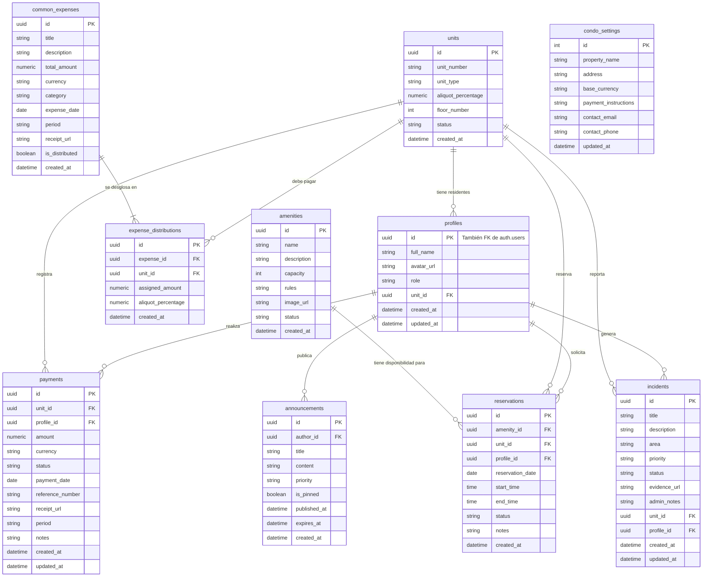
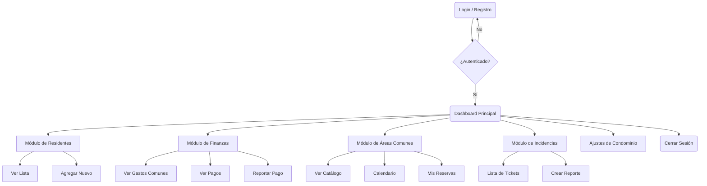
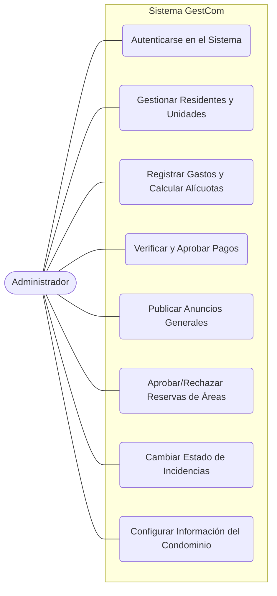
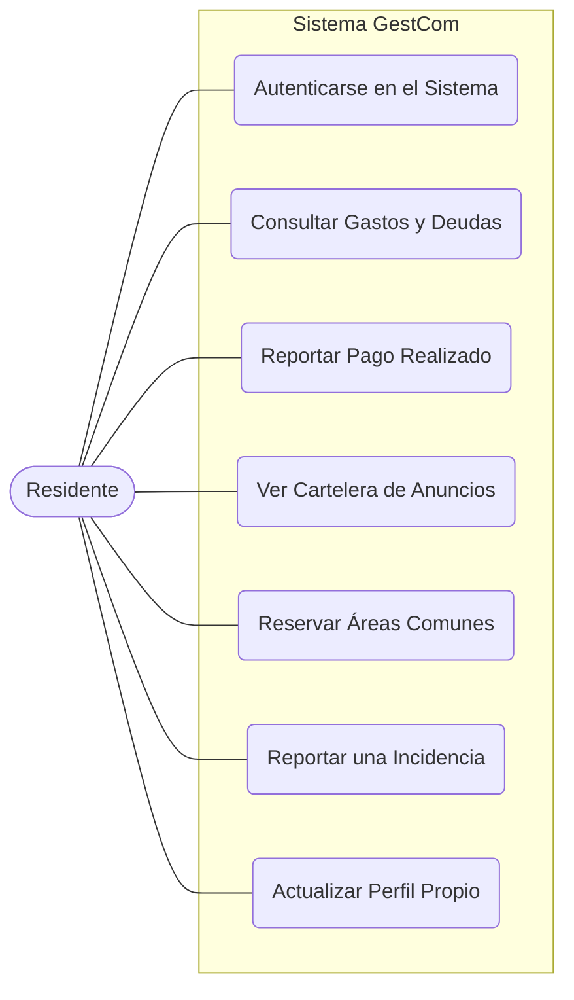

# Diagramas del Sistema GestCom

Aquí encontrarás los diagramas técnicos del proyecto renderizables gracias al soporte nativo de Markdown (o usando visualizadores como Mermaid Live).

## 1. Modelo Entidad-Relación (Base de Datos)



---

## 2. Mapa de Navegación de la Interfaz Gráfica

Como Mermaid no renderiza mockups visuales exactos, la mejor forma de representar la Interfaz Gráfica a nivel de arquitectura de software es mediante un Mapa de Navegación (Flowchart) que muestra cómo se conectan las diferentes vistas y pantallas del sistema.



---

## 3. Carta Estructural (Arquitectura de Módulos)

La Carta Estructural representa la arquitectura física de carpetas y archivos del código fuente, organizada bajo el marco de trabajo de Next.js (App Router), vinculando cada directorio con su función lógica en el sistema.

```text
GestCom_App/
├── app/                      # Configuración de rutas (App Router)
│   ├── (auth)/               # Grupo de rutas de autenticación
│   │   ├── forgot-password/  # Formulario de solicitud de recuperación
│   │   ├── login/
│   │   │   └── page.tsx      # Interfaz de Inicio de Sesión y OAuth
│   │   └── update-password/  # Formulario de restablecimiento de contraseña
│   ├── actions/              # Lógica de servidor (Server Actions)
│   │   └── auth.ts           # Funciones de login, registro, envío de emails
│   ├── auth/
│   │   └── callback/         # Manejo de la redirección de Supabase / OAuth
│   ├── dashboard/            # Rutas protegidas del panel de administración
│   │   ├── residents/        # Módulo de gestión de residentes (CRUD y Tablas)
│   │   └── page.tsx          # Resumen principal (Dashboard Overview)
│   ├── globals.css           # Estilos base y directivas de Tailwind CSS
│   ├── layout.tsx            # Plantilla principal y configuración global
│   └── page.tsx              # Página inicial o redirección por defecto
│
├── components/               # Componentes de Interfaz (UI) reutilizables
│   └── ui/                   # Componentes base instalados (Shadcn UI)
│
├── lib/                      # Librerías, utilidades y conexiones
│   └── supabase/             # Cliente oficial de conexión hacia Supabase
│       ├── client.ts         # Cliente Supabase para el navegador (Frontend)
│       └── server.ts         # Cliente Supabase para el servidor (Backend)
│
├── supabase/                 # Configuración del Backend as a Service (BaaS)
│   └── migrations/           # Esquemas DDL y tablas de la base de datos PostgreSQL
│
├── public/                   # Archivos estáticos directos al cliente (Imágenes, Íconos)
│
├── package.json              # Lista de dependencias (Next.js, Tailwind, Supabase)
├── tailwind.config.ts        # Configuración del motor de estilos Tailwind CSS
└── .env.local                # Variables de entorno secretas (Claves, SMTP, URLs)
```

---

## 4. Diagramas de Casos de Uso

Los diagramas de casos de uso muestran las interacciones principales que tiene cada actor (usuario) con el sistema, definiendo qué operaciones pueden realizar según su rol.

### 4.1. Actor: Administrador



### 4.2. Actor: Residente


